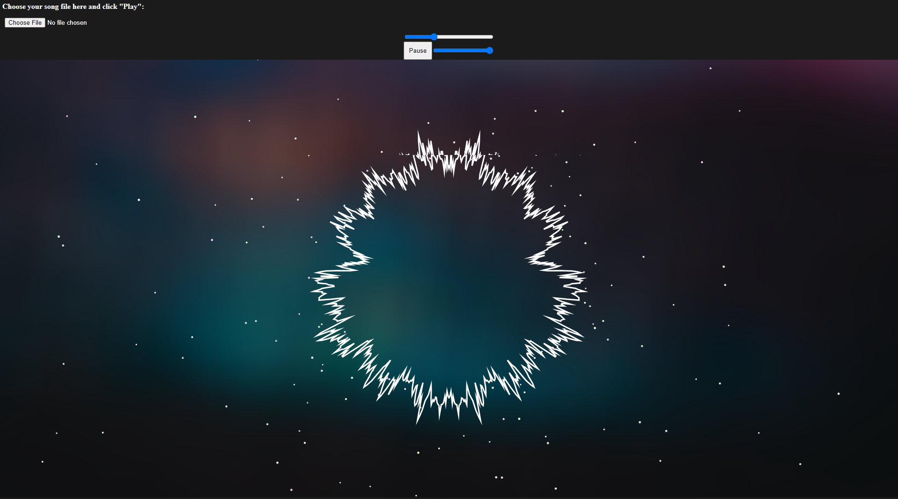

# beatWave

## General Info
Built an application that takes a song and visualizes the waveforms of the audio as the song plays.

## Technologies
JavaScript, p5.js

## Deployment
See this project live at [https://jchen2190.github.io/beatWave/](https://jchen2190.github.io/beatWave/).